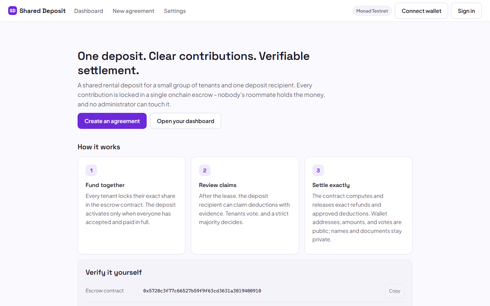
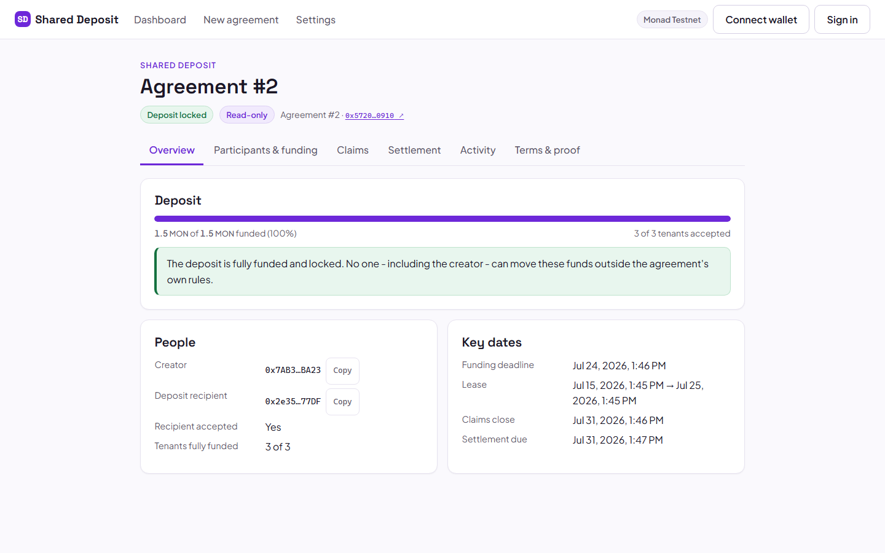
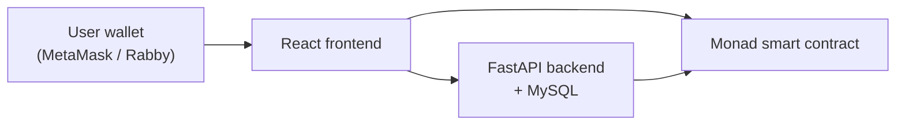

# Shared Deposit

[](https://github.com/rustsol/shared-deposit-monad/actions/workflows/ci.yml)
[](LICENSE)

A wallet-based rental deposit escrow application built on Monad.

Roommates or tenants contribute to one shared security deposit. Each participant
uses their own wallet, and a smart contract holds and accounts for the funds
instead of one roommate or a landlord. Every contribution, acceptance, and
deposit is a real on-chain transaction signed by the participant.

The smart contract is the source of truth for money: custody, funding, claims,
voting, settlement, and withdrawals all follow its rules. A FastAPI backend and
MySQL store private metadata and a verified record of application transactions.
The backend never holds user private keys and never signs transactions for
users.





## Status

This is an MVP running on Monad Testnet.

| Item | Value |
| --- | --- |
| Network | Monad Testnet |
| Chain ID | 10143 |
| Escrow contract | `0x5720c3f77c66527b59f9f63cd3631a3019400910` |
| Stage | Testnet MVP, not production |

The escrow contract is deployed and source-verified. The application supports
the full funding lifecycle end to end. Later lifecycle screens are listed under
Roadmap.

## What works today

- Wallet connection and Sign-In with Ethereum (EIP-4361) authentication.
- Agreement creation with 2 to 8 tenant wallets and one separate recipient wallet.
- Per-tenant contribution amounts, funding deadline, and lease dates.
- Tenant acceptance and recipient acceptance on-chain.
- Deposit funding in native MON, with automatic activation once every tenant has
  accepted and fully funded.
- Pre-activation withdrawal and funding-expiry cancellation.
- Transaction persistence in MySQL, receipt verification, and a direct
  contract-state refresh after each write.
- A verified per-agreement activity history built from stored transactions.
- Role-aware actions (creator, tenant, recipient) derived from the connected wallet.
- Read-only Claims and Settlement views read directly from the contract.
- Responsive interface tested at common desktop and mobile widths.

The smart contract also implements deduction claims, tenant voting, settlement,
and withdrawals. Those actions are enforced on-chain and shown as read-only in
the app today. The write interfaces for them are on the Roadmap.

## How it works

1. A tenant creates the agreement with the participants, amounts, and dates.
2. Participants connect and sign in with their wallets.
3. Each tenant accepts the terms and deposits their required amount.
4. The recipient accepts the terms.
5. The contract activates automatically when all tenants have accepted and funded.
6. Later lifecycle actions (claims, voting, settlement, withdrawals) follow the
   contract rules.

## Architecture



- The wallet signs every transaction. The backend never signs for the user.
- The smart contract stores the authoritative financial state.
- MySQL stores application metadata, authentication data, cached state, and a
  verified record of transactions made through the app.

Page loads read financial state directly from the contract. The stored cache is
treated as a cache: if it disagrees with a direct read, the backend refreshes it.

## Technology

| Layer | Tools |
| --- | --- |
| Frontend | React, TypeScript, Vite, Wagmi, Viem |
| Backend | Python, FastAPI, SQLAlchemy, Alembic, MySQL |
| Contracts | Solidity, Hardhat, OpenZeppelin |
| Blockchain | Monad Testnet |
| Tests | Vitest (frontend), pytest (backend), Hardhat (contracts) |

## Repository layout

```
backend/     FastAPI service, SQLAlchemy models, Alembic migrations, tests
frontend/    React + Vite application and tests
contracts/   Solidity escrow, Hardhat config, tests, deployment metadata
scripts/     PowerShell helpers for local setup and running
```

## Prerequisites

- Git
- Python 3.11 or newer
- Node.js 20 or newer, with npm
- MySQL 8.0 or newer (or MariaDB 10.6 or newer)
- A browser wallet such as MetaMask or Rabby
- A small amount of Monad Testnet MON for gas

A deployment private key is not required to run the application against the
existing deployment.

## Local installation

Commands below use Windows PowerShell. A note for macOS and Linux follows where
a command differs.

Clone the repository:

```powershell
git clone https://github.com/rustsol/shared-deposit-monad.git
cd shared-deposit-monad
```

### Database

Create the database (adjust the user and password to your local MySQL):

```powershell
mysql -h 127.0.0.1 -P 3306 -u root -p -e "CREATE DATABASE shared_deposit CHARACTER SET utf8mb4 COLLATE utf8mb4_unicode_ci"
```

### Backend

```powershell
cd backend
python -m venv .venv
.\.venv\Scripts\python.exe -m pip install -e ".[dev]"
Copy-Item .env.example .env
.\.venv\Scripts\python.exe -m alembic upgrade head
```

Edit `backend\.env` and set `DATABASE_URL` to your local MySQL, and set a fresh
`SESSION_SECRET`. Generate one with:

```powershell
python -c "import secrets; print(secrets.token_hex(32))"
```

### Frontend

```powershell
cd ..\frontend
npm install
```

If dependency resolution stalls, run `npm install --legacy-peer-deps`.

No frontend `.env` is required for local development. The Vite dev server proxies
`/api` to the backend so session cookies stay same-origin.

### Contracts (optional)

The contract is already deployed, so this is only needed to compile or run the
contract tests.

```powershell
cd ..\contracts
npm install
npx hardhat compile
```

On macOS or Linux, replace `.\.venv\Scripts\python.exe` with
`./.venv/bin/python` and `Copy-Item` with `cp`.

## Environment configuration

Backend configuration lives in `backend\.env` (never committed). See
`backend\.env.example` for the full list.

Public values (safe to keep as shipped):

- `CHAIN_ID` = 10143
- `RPC_URL` = https://testnet-rpc.monad.xyz
- Escrow contract address (from `contracts/deployments/monad-testnet.json`)
- `FRONTEND_ORIGIN` = http://localhost:5173

Private values you set yourself:

- `DATABASE_URL` (contains your local database password)
- `SESSION_SECRET` (generate a fresh value, see above)

Generate your own local secrets. Never place a wallet seed phrase or private key
in the repository or in any committed `.env` file.

## Running the application

Backend (from `backend`):

```powershell
.\.venv\Scripts\python.exe -m uvicorn app.main:app --host 127.0.0.1 --port 8000 --reload
```

Frontend (from `frontend`):

```powershell
npm run dev
```

Local URLs:

- Frontend: http://localhost:5173
- Backend API docs: http://127.0.0.1:8000/docs
- Backend readiness: http://127.0.0.1:8000/api/v1/readiness
- Network diagnostics (development only): http://localhost:5173/developer/network

## Running tests

Backend (from `backend`):

```powershell
.\.venv\Scripts\python.exe -m pytest -q
.\.venv\Scripts\python.exe -m ruff check .
.\.venv\Scripts\python.exe -m mypy
```

Frontend (from `frontend`):

```powershell
npm test
npm run typecheck
npm run lint
npm run build
```

Contracts (from `contracts`):

```powershell
npx hardhat test
```

Backend tests run against a real MySQL server. They create and drop guarded
databases whose names end in `_test` and never touch `shared_deposit`.

## Smart contract

- Network: Monad Testnet (chain ID 10143)
- Address: `0x5720c3f77c66527b59f9f63cd3631a3019400910`
- Explorer: https://testnet.monadscan.com/address/0x5720c3f77c66527b59f9f63cd3631a3019400910
- The deployed source is verified. This deployment is for testing.

The contract has no owner, no platform fee, and no admin path that can move
funds. It has not had a formal external security audit.

## Security model

- Users sign every transaction through their own wallets.
- The backend does not custody funds and does not store wallet private keys.
- The smart contract is the source of truth for financial state.
- MySQL stores application metadata, authentication data, cached state, and a
  verified record of application transactions.

This is a testnet MVP. It does not claim complete security.

## Known limitations

- Monad Testnet only. There is no production hosting configuration in this repository.
- Transactions submitted outside the application update on-chain state, and the
  app reads that state directly, but they do not appear in the stored activity
  history.
- Claims, voting, settlement, and withdrawal write interfaces are not finished
  in the app. The contract enforces them and the app shows them read-only.
- The contract has not had a formal external security audit.

## Roadmap

- Claims and evidence submission interface
- Tenant voting interface
- Settlement and finalization interface
- Refund and payout withdrawals in the app
- Production deployment
- External security review

## Contributing

Issues and pull requests are welcome. Please run the backend, frontend, and
contract tests before opening a pull request.

## License

Released under the MIT License. See [LICENSE](LICENSE).
